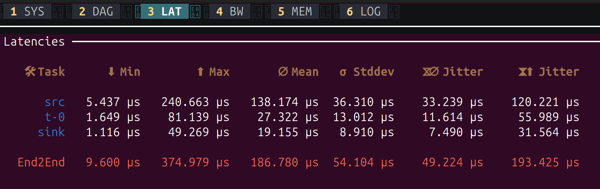
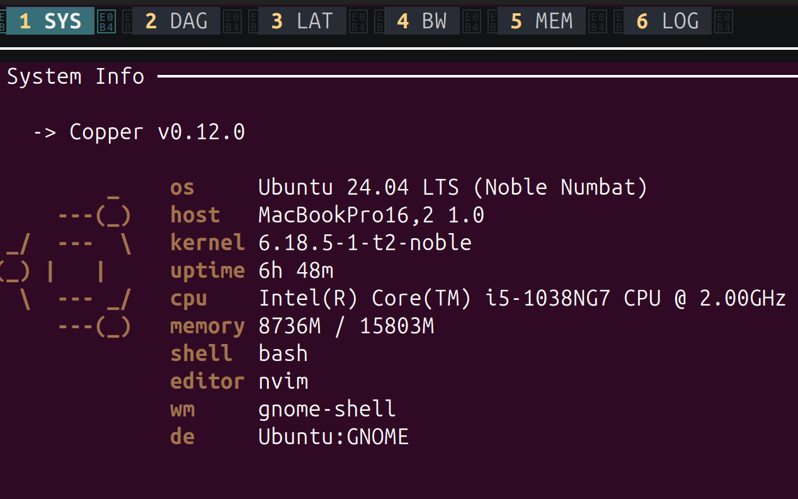
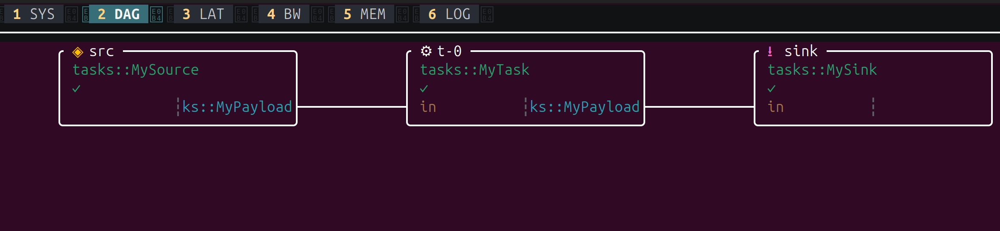
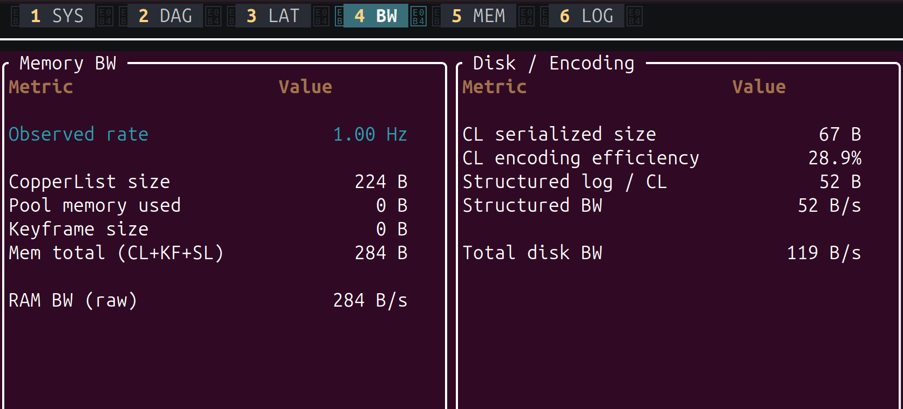
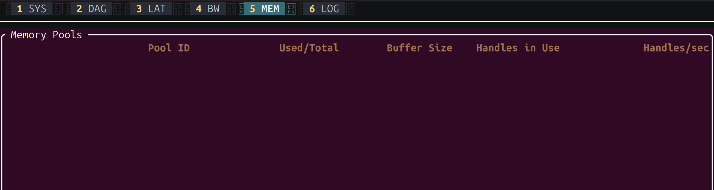
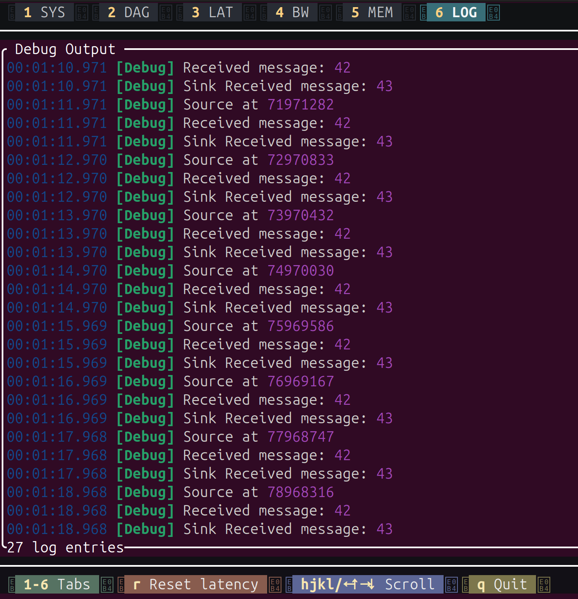

# Adding the Console Monitor

In the previous chapter we controlled the loop frequency. But how do we know how fast each
task actually runs? How much time does `process()` take? What's the jitter?

Copper comes with a built-in TUI (terminal user interface) monitor called **CuConsoleMon**
that displays live statistics for every task in your pipeline -- mean execution time,
standard deviation, min, max, and more.

## Step 1: Add the dependency

Add `cu-consolemon` to your `Cargo.toml`:

```toml
[dependencies]
cu29 = { git = "https://github.com/copper-project/copper-rs" }
cu29-helpers = { git = "https://github.com/copper-project/copper-rs" }
cu-consolemon = { git = "https://github.com/copper-project/copper-rs" }
bincode = { package = "cu-bincode", version = "2.0", default-features = false,
            features = ["derive", "alloc"] }
serde = { version = "1", features = ["derive"] }
```

The only new line is `cu-consolemon`.

## Step 2: Enable it in copperconfig.ron

Add a `monitor` section to your `copperconfig.ron`:

```ron
(
    tasks: [
        (
            id: "src",
            type: "tasks::MySource",
        ),
        (
            id: "t-0",
            type: "tasks::MyTask",
        ),
        (
            id: "sink",
            type: "tasks::MySink",
        ),
    ],
    cnx: [
        (
            src: "src",
            dst: "t-0",
            msg: "crate::tasks::MyPayload",
        ),
        (
            src: "t-0",
            dst: "sink",
            msg: "crate::tasks::MyPayload",
        ),
    ],
    runtime: (
        rate_target_hz: 1,
    ),
    monitor: (
        type: "cu_consolemon::CuConsoleMon",
    ),
)
```

## Step 3: Run

```bash
cargo run
```

Instead of the scrolling debug output you're used to, you'll see a **live terminal
dashboard** that takes over your terminal. Navigate to the latency tab (you can click on it)



The latency tab shows one row per task, plus an **End2End** row at the bottom for the
entire pipeline. Here's what each column means:

| Column | Meaning |
|---|---|
| **Task** | The task `id` from your `copperconfig.ron` |
| **Min** | Fastest `process()` execution seen across all cycles |
| **Max** | Slowest `process()` execution seen (watch for spikes here) |
| **Mean** | Average `process()` execution time |
| **Stddev** | Standard deviation -- how much the execution time varies. Lower is more predictable |
| **Jitter (mean)** | Average difference between consecutive cycle times. Indicates how stable the timing is |
| **Jitter (max)** | Worst-case jitter seen. A large value means occasional timing spikes |

The **End2End** row measures the full pipeline latency: from the start of `src` to the end
of `sink`. In our example, the entire pipeline completes in about 187 µs on average, with
a worst case of 375 µs.

This is extremely useful for:

- **Verifying your frequency**: Are your tasks fast enough for the target `rate_target_hz`?
- **Finding bottlenecks**: Which task takes the most time?
- **Detecting jitter**: A high Std Dev means unpredictable execution time, which could be
  a problem for real-time control.

## Difference with ROS

In ROS 2, getting this kind of per-node timing data typically requires external tools like
`ros2 topic hz`, `ros2 topic delay`, or hooking up a tracing framework. Each tool gives
you one metric at a time, for one topic.

In Copper, the console monitor is built into the runtime. One line of config gives you a
live dashboard of every task in the system, with no external tooling needed.

Press **Ctrl+C** to stop the application as usual.

## The other tabs

The monitor has six tabs, accessible by pressing `1` through `6` or clicking on them.

### 1 - SYS: System Info



Displays your system information: OS, kernel, CPU, memory, and the Copper version. Useful
for documenting what hardware a recording was made on.

### 2 - DAG: Task Graph



A visual representation of your task graph. Each box is a task, showing its `id`, Rust
type, and the message types on its connections. This is your `copperconfig.ron` rendered
live -- a quick way to verify the pipeline is wired correctly.

### 4 - BW: Bandwidth



Shows memory and disk bandwidth consumed by the runtime. The left panel (**Memory BW**)
reports the observed loop rate, CopperList size, and raw memory throughput. The right panel
(**Disk / Encoding**) shows the serialized size of each CopperList, encoding efficiency,
structured log bandwidth, and total disk write rate. Useful for sizing your log storage
and checking that the logger can keep up.

### 5 - MEM: Memory Pools



Displays the status of Copper's pre-allocated memory pools: pool ID, used vs total
buffers, buffer size, handles in use, and allocation rate. In our simple project the pools
are empty, but on a real robot with large messages (images, point clouds), this helps you
verify that buffers are correctly sized and not exhausted.

### 6 - LOG: Debug Output



A scrollable view of all `debug!()` log output from your tasks -- the same messages you'd
see without the monitor, but captured inside the TUI. You can scroll through the history
with `hjkl` or arrow keys. The bottom bar also shows keyboard shortcuts: `r` to reset
latency statistics, `q` to quit.


