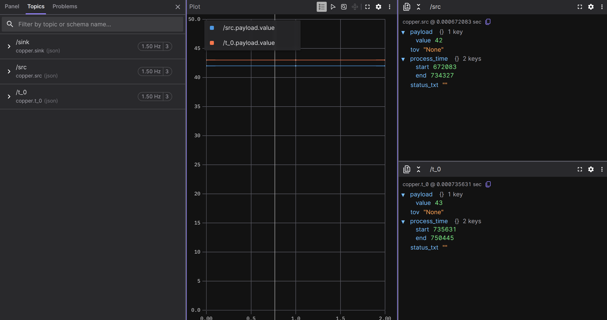

# Exporting Data to Other Formats

In the [logging chapter](./ch13-logging-replay.md), we learned how Copper records everything
into `.copper` files and how the log reader can extract text logs and CopperList data as
JSON. But JSON is just the beginning. Real-world workflows often need data in other
formats -- CSV for spreadsheets and data science tools, MCAP for visualization in
[Foxglove](https://foxglove.dev/), or statistics JSON for offline performance analysis.

The log reader CLI you already have supports all of these. In this chapter, we'll explore
every export format and diagnostic tool available in `cu29-export`.

## A quick refresher

Recall from Chapter 13 that your project ships with a log reader binary at
`src/logreader.rs`:

```rust
pub mod tasks;

use cu29::prelude::*;
use cu29_export::run_cli;

gen_cumsgs!("copperconfig.ron");

#[cfg(feature = "logreader")]
fn main() {
    run_cli::<CuStampedDataSet>().expect("Failed to run the export CLI");
}
```

This program uses the `gen_cumsgs!` macro to generate a `CuStampedDataSet` type that knows
how to decode your project's specific messages. Every subcommand we'll use in this chapter
goes through this same binary -- you just pass different arguments.

Make sure you have a `.copper` log file from a previous run (see Chapter 13 if you need to
generate one):

```bash
ls -lh logs/
```

```text
-rw-r--r-- 1 user user 4.0K  logs/my-project.copper
```

## CSV export

We already saw how `extract-copperlists` outputs JSON by default. But if you're working
with spreadsheets, pandas, or any data analysis tool, CSV is often more convenient.

The `--export-format` flag (or `-e` for short) switches the output format:

```bash
cargo run --features logreader --bin my-project-logreader -- \
    logs/my-project.copper extract-copperlists --export-format csv
```

The output looks like this:

```text
id, src_time, src_tov, src,, t_0_time, t_0_tov, t_0,, sink_time, sink_tov, sink,
0, [672.083 µs – 734.327 µs], None, {"value":42}, [735.631 µs – 750.445 µs], None, {"value":43}
1, [1.000 s – 1.000 s], None, {"value":42}, [1.000 s – 1.000 s], None, {"value":43}
2, [2.000 s – 2.000 s], None, {"value":42}, [2.000 s – 2.000 s], None, {"value":43}
...
```

Each row is one CopperList (one execution cycle). The columns are:

- **`id`** -- The CopperList sequence number.
- **`<task>_time`** -- The process time range (start-end in nanoseconds) for that task's
  `process()` call.
- **`<task>_tov`** -- The time of validity, if the task set one.
- **`<task>`** -- The payload as inline JSON.

The column headers are generated from your task IDs, so they'll match whatever you named
your tasks in `copperconfig.ron`.

> **Tip:** You can redirect the output to a file and open it in any spreadsheet application
> or load it into a pandas DataFrame:
>
> ```bash
> cargo run --features logreader --bin my-project-logreader -- \
>     logs/my-project.copper extract-copperlists -e csv > data.csv
> ```
>
> ```python
> import pandas as pd
> df = pd.read_csv("data.csv")
> ```

## Checking log integrity with fsck

Before doing any analysis on a log file, it's good practice to verify its integrity. The
`fsck` subcommand reads the entire log and checks that all sections are well-formed:

```bash
cargo run --features logreader --bin my-project-logreader -- \
    logs/my-project.copper fsck
```

```text
The log checked out OK.
        === Statistics ===
  Total time       -> 1.999 s
  Total used size  -> 328 bytes
  Logging rate     -> 0.00 MiB/s (effective)

  # of CL          -> 2
  CL rate          -> 1.00 Hz
  CL total size    -> 129 bytes

  # of Keyframes   -> 1
  KF rate          -> 0.50 Hz
  KF total size    -> 7 bytes

  # of SL entries  -> 13
  SL total size    -> 192 bytes
```

Even without the verbose flag, `fsck` gives you a useful summary:

- **Total time** -- How long the recording lasted.
- **CL rate** -- How many CopperLists per second were logged (should match your
  `rate_target_hz`).
- **Keyframes** -- Periodic snapshots of frozen task state, used for seeking during replay.
- **SL entries** -- The number of structured log lines (`debug!()`, `info!()`, etc.).

### Verbose mode

Add `-v` for section-by-section details, or `-vv` for maximum verbosity:

```bash
cargo run --features logreader --bin my-project-logreader -- \
    logs/my-project.copper fsck -v
```

This prints every section header as it's read, along with the CopperList ID ranges and
time ranges within each section. It's invaluable for debugging corrupted logs -- you can
see exactly where the corruption starts.

## Log statistics

The `log-stats` subcommand computes per-edge statistics from the log and writes them as a
JSON file. This is useful for offline analysis of your task graph's performance:

```bash
cargo run --features logreader --bin my-project-logreader -- \
    logs/my-project.copper log-stats --output stats.json --config copperconfig.ron
```

This produces a `stats.json` file with detailed statistics for every edge in your task
graph:

```json
{
  "schema_version": 1,
  "config_signature": "fnv1a64:166f6eae65f80d15",
  "mission": null,
  "edges": [
    {
      "src": "src",
      "dst": "sink",
      "msg": "crate::tasks::MyPayload",
      "samples": 3,
      "none_samples": 0,
      "valid_time_samples": 3,
      "total_raw_bytes": 12,
      "avg_raw_bytes": 4.0,
      "rate_hz": 1.0004343150476716,
      "throughput_bytes_per_sec": 6.002605890286029
    },
    {
      "src": "src",
      "dst": "t-0",
      "msg": "crate::tasks::MyPayload",
      "samples": 3,
      "none_samples": 0,
      "valid_time_samples": 3,
      "total_raw_bytes": 12,
      "avg_raw_bytes": 4.0,
      "rate_hz": 1.0004343150476716,
      "throughput_bytes_per_sec": 6.002605890286029
    },
    {
      "src": "t-0",
      "dst": "sink",
      "msg": "crate::tasks::MyPayload",
      "samples": 3,
      "none_samples": 0,
      "valid_time_samples": 3,
      "total_raw_bytes": 12,
      "avg_raw_bytes": 4.0,
      "rate_hz": 1.0004283749265024,
      "throughput_bytes_per_sec": 6.002570249559014
    }
  ],
  "perf": {
    "samples": 3,
    "valid_time_samples": 3,
    "end_to_end": {
      "min_ns": 74413,
      "max_ns": 178994,
      "mean_ns": 114416.0,
      "stddev_ns": 46095.0
    },
    "jitter": {
      "min_ns": 15429,
      "max_ns": 104581,
      "mean_ns": 60005.0,
      "stddev_ns": 44576.0
    }
  }
}
```

For each edge in the graph, you get:

- **`samples`** -- Total number of CopperLists processed.
- **`none_samples`** -- How many times the payload was `None` (the task produced no
  output for that cycle).
- **`rate_hz`** -- The measured message rate on this edge.
- **`avg_raw_bytes`** -- Average payload size in bytes.
- **`throughput_bytes_per_sec`** -- Sustained data throughput on this edge.

The `perf` section gives you pipeline-level timing:

- **`end_to_end`** -- Latency from the first task's `process()` start to the last task's
  `process()` end, across the full pipeline.
- **`jitter`** -- Variation in that end-to-end latency between consecutive cycles.

### Using with missions

If your project uses missions, pass the `--mission` flag to select which
mission's graph to use for the edge mapping:

```bash
cargo run --features logreader --bin my-project-logreader -- \
    logs/my-project.copper log-stats --config copperconfig.ron --mission normal
```

## MCAP export for Foxglove

[MCAP](https://mcap.dev/) is an open-source container format designed for multimodal
robotics data. It's the native format of [Foxglove](https://foxglove.dev/), a powerful
web-based visualization tool for robotics. Exporting your Copper logs to MCAP lets you
visualize your pipeline's data in Foxglove's timeline, plot panels, and 3D views.

### Enabling the MCAP feature

MCAP export requires an additional feature flag. Add `mcap` to your logreader's feature
dependencies in `Cargo.toml`:

```toml
[features]
logreader = ["dep:cu29-export"]
logreader-mcap = ["logreader", "cu29-export/mcap"]
```

And make sure `cu29-export` has the `mcap` feature available:

```toml
[dependencies]
cu29-export = { version = "0.8", optional = true, features = ["mcap"] }
```

> **Note:** The exact version and dependency syntax may vary. Check the latest Copper
> documentation for the current setup.

### Implementing `PayloadSchemas`

When the `mcap` feature is enabled, `run_cli` requires your `CuStampedDataSet` to
implement the `PayloadSchemas` trait. This trait tells the MCAP exporter what JSON Schema
to use for each task's payload, so Foxglove can understand your data structure.

The `gen_cumsgs!` macro does **not** implement this trait automatically -- you need to add
the implementation yourself in `src/logreader.rs`. Here's what it looks like for our
project where every task uses `MyPayload`:

```rust
pub mod tasks;

use cu29::prelude::*;
use cu29_export::run_cli;

gen_cumsgs!("copperconfig.ron");

#[cfg(feature = "logreader-mcap")]
use cu29_export::serde_to_jsonschema::trace_type_to_jsonschema;
#[cfg(feature = "logreader-mcap")]
impl PayloadSchemas for cumsgs::CuStampedDataSet {
    fn get_payload_schemas() -> Vec<(&'static str, String)> {
        let task_ids =
            <cumsgs::CuStampedDataSet as MatchingTasks>::get_all_task_ids();
        let schema = trace_type_to_jsonschema::<tasks::MyPayload>();
        task_ids.iter().map(|&id| (id, schema.clone())).collect()
    }
}

fn main() {
    run_cli::<CuStampedDataSet>().expect("Failed to run the export CLI");
}
```

The key pieces:

- **`trace_type_to_jsonschema::<T>()`** -- Introspects a Rust type at compile time using
  `serde-reflection` and produces a JSON Schema string. Your payload type must derive
  `Serialize` and `Deserialize`.
- **`MatchingTasks::get_all_task_ids()`** -- Returns the task IDs from your config, in
  graph order. The macro generates this for you.
- The `#[cfg(feature = "logreader-mcap")]` guard ensures this code only compiles when the
  MCAP feature is active, so your regular `logreader` feature keeps working without
  the extra dependency.

If your tasks use **different** payload types, you'll need to map each task ID to its
specific schema instead of reusing a single one. See the
[cu_caterpillar example](https://github.com/copper-project/copper-rs/blob/master/examples/cu_caterpillar/src/logreader.rs)
in the Copper repository for a reference.

### Exporting to MCAP

Once the feature is enabled, a new `export-mcap` subcommand becomes available:

```bash
cargo run --features logreader-mcap --bin my-project-logreader -- \
    logs/my-project.copper export-mcap --output data.mcap
```

```text
Exporting copperlists to MCAP format: data.mcap
MCAP Export: 5 CopperLists → 10 messages, 2 channels, 2 schemas
```

The export creates one MCAP **channel** per task output (named `/<task-id>`), and one
**schema** per message type. Schemas are generated automatically at compile time using
`serde-reflection` -- the exporter introspects your Rust types and produces JSON Schema
definitions that Foxglove can use to understand the data structure.

Each MCAP message contains:

- **`payload`** -- Your task's output, serialized as JSON.
- **`tov`** -- The time of validity.
- **`process_time`** -- Start and end timestamps of the task's `process()` call.
- **`status_txt`** -- Any status text the task set.

### Inspecting MCAP files

The `mcap-info` subcommand lets you inspect an MCAP file without opening Foxglove:

```bash
cargo run --features logreader-mcap --bin my-project-logreader -- \
    logs/my-project.copper mcap-info data.mcap
```

```text
=== MCAP File Info ===
File: data.mcap
Size: 2617 bytes (0.00 MB)

=== Statistics ===
Total messages: 9
Channels: 3
Schemas: 3

=== Channels ===
  /sink [json] (schema: copper.sink): 3 messages
  /src [json] (schema: copper.src): 3 messages
  /t_0 [json] (schema: copper.t_0): 3 messages

=== Schemas ===
Schema: copper.sink (encoding: jsonschema)

Schema: copper.src (encoding: jsonschema)

Schema: copper.t_0 (encoding: jsonschema)
```

Add `--schemas` to print the full JSON Schema for each channel, or `-n 3` to show the
first 3 sample messages per channel:

```bash
cargo run --features logreader-mcap --bin my-project-logreader -- \
    logs/my-project.copper mcap-info data.mcap --schemas -n 1
```

### Opening in Foxglove

Once you have an `.mcap` file, open it in Foxglove:

1. Go to [app.foxglove.dev](https://app.foxglove.dev/) (or use the desktop app).
2. Click **"Open local file"** and select your `.mcap` file.
3. Your channels (`/src`, `/t-0`, etc.) appear in the sidebar.
4. Add a **Raw Messages** panel to see the JSON payloads, or a **Plot** panel to graph
   numeric fields over time.

Because the MCAP file includes JSON Schema definitions, Foxglove knows the structure of
your messages and can offer autocomplete for field names in plots.

Foxglove has plenty of tutorials on how to set up the Panels. Here is a basic UI showing our data with plots and raw messages:



## Summary of subcommands

Here's a quick reference for all the log reader subcommands:

| Subcommand | What it does | Feature needed |
|---|---|---|
| `extract-text-log <index>` | Reconstructs human-readable text logs | -- |
| `extract-copperlists` | Dumps CopperList data (JSON or CSV) | -- |
| `extract-copperlists -e csv` | Dumps CopperList data as CSV | -- |
| `fsck` | Checks log integrity and prints statistics | -- |
| `log-stats` | Computes per-edge statistics as JSON | -- |
| `export-mcap --output f.mcap` | Exports to MCAP format for Foxglove | `mcap` |
| `mcap-info <file>` | Inspects an MCAP file | `mcap` |
